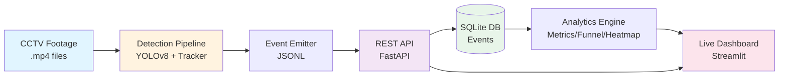

# Store Intelligence — Apex Retail Analytics

End-to-end retail analytics: raw CCTV footage → detection pipeline → REST API → live dashboard.

---

## Architecture



**Data Flow:**
1. **Detection Pipeline** — YOLOv8n detects persons, IoU tracker assigns IDs, events emitted (enter/exit/dwell/queue)
2. **API Ingestion** — Batch POST to `/events/ingest`, deduplicated by `event_id`, stored in SQLite
3. **Analytics Layer** — Real-time queries compute metrics, funnels, heatmaps, anomalies
4. **Dashboard** — Streamlit polls API every 5–60s, visualizes KPIs + alerts

---

## Quick Start (5 commands)

```bash
git clone <your-repo-url> && cd store-intelligence
docker compose up --build          # starts API on :8000
python pipeline/run.py             # detect events from clips → POST to API
python -m pytest tests/ -v         # run test suite
streamlit run dashboard/app.py     # live dashboard on http://localhost:8501
```

> **Prerequisites**: Docker Desktop, Python 3.11+, `pip install -r requirements.txt`

---

## Running the Detection Pipeline

### Against the provided clips

```bash
# From repo root — detects all .mp4 files in dataset/videos/
python pipeline/run.py \
  --videos  dataset/videos \
  --layout  dataset/layouts/store_layout.json \
  --store   STORE_001 \
  --output  data/events/events.jsonl \
  --api     http://localhost:8000
```

This will:
1. Run YOLOv8n detection + IoU tracker on every `.mp4` in `--videos`
2. Emit structured events to `--output` (JSONL format)
3. POST all events to `--api/events/ingest` in batches of 200

### Detection only (no API post)

```bash
python pipeline/run.py --no-ingest
```

### Manual ingest from existing events file

```bash
python load_events.py   # posts data/events/events.jsonl → http://localhost:8000
```

---

## API Endpoints

| Method | Endpoint | Description |
|---|---|---|
| `POST` | `/events/ingest` | Ingest up to 500 events. Idempotent by `event_id`. |
| `GET` | `/stores/{id}/metrics` | Unique visitors, conversion rate, dwell, queue depth, abandonment |
| `GET` | `/stores/{id}/funnel` | 4-stage funnel with drop-off % |
| `GET` | `/stores/{id}/heatmap` | Zone visit frequency + dwell, normalised 0–100 |
| `GET` | `/stores/{id}/anomalies` | Queue spike, dead zone, conversion drop |
| `GET` | `/health` | Service status + per-store STALE_FEED warning |

Interactive docs: **http://localhost:8000/docs**

---

## Live Dashboard

```bash
streamlit run dashboard/app.py
```

Opens at **http://localhost:8501**

Features:
- KPI cards: visitors, conversion rate, queue depth, abandonment
- Live conversion funnel (Plotly)
- Zone heatmap (visit score + dwell score)
- Active anomalies panel with suggested actions
- System health table per store
- Auto-refresh every 5–60 seconds (configurable)

---

## Running Tests

```bash
python -m pytest tests/ -v                    # all 28 tests
python -m pytest tests/ --cov=app --cov-report=term-missing   # with coverage
```

---

## Project Structure

```
store-intelligence/
├── pipeline/
│   ├── detect.py       # YOLOv8 + custom IoU/histogram tracker
│   ├── tracker.py      # Re-ID + re-entry detection
│   ├── emit.py         # Event schema builder + zone classifier
│   └── run.py          # One-command pipeline runner
├── app/
│   ├── main.py         # FastAPI app + middleware
│   ├── models.py       # Pydantic event schema
│   ├── ingestion.py    # Batch ingest + dedup
│   ├── metrics.py      # Real-time metric queries
│   ├── funnel.py       # Session funnel
│   ├── heatmap.py      # Zone heatmap
│   ├── anomalies.py    # Anomaly detection
│   ├── health.py       # Health endpoint
│   ├── logger.py       # Structured JSON logging
│   └── database/db.py  # SQLite + auto-migration
├── dashboard/
│   └── app.py          # Streamlit live dashboard
├── tests/
│   ├── test_metrics.py
│   ├── test_funnel.py
│   └── test_anomalies.py
├── docs/
│   ├── DESIGN.md
│   └── CHOICES.md
├── docker-compose.yml
├── Dockerfile
└── requirements.txt
```

---

## Design Notes

See [`docs/DESIGN.md`](docs/DESIGN.md) for architecture overview and AI-assisted decisions.  
See [`docs/CHOICES.md`](docs/CHOICES.md) for model selection, schema rationale, and API architecture reasoning.
